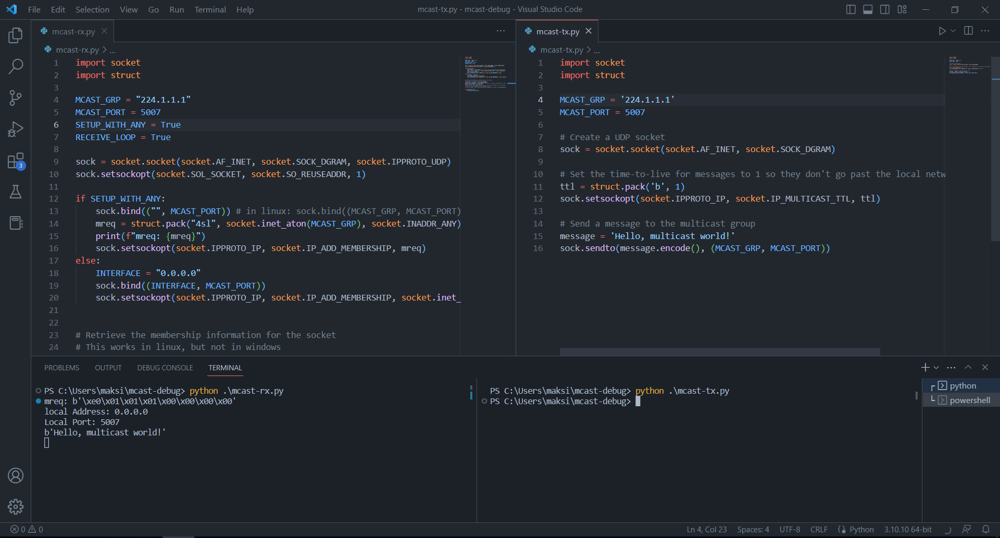
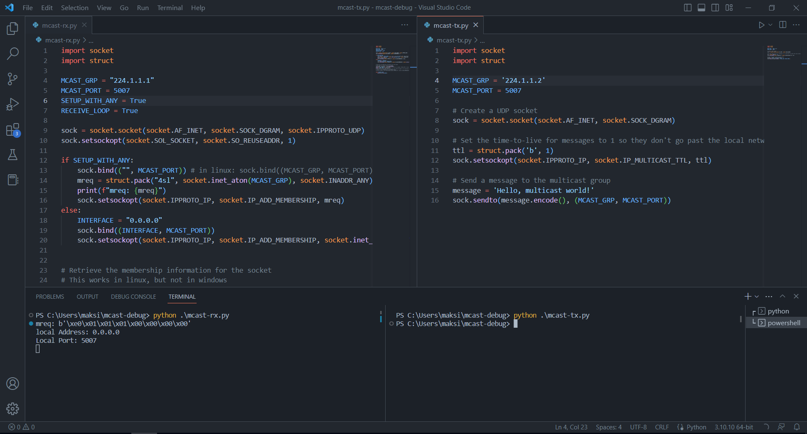

# Multicast sockets in Windows: Question

The question:

> Using only the socket object itself: how to find out which multicast groups a socket is subscribed to?
> 
> (Windows, Python 3.10)

See code comments for additional information.

Example 1 (working, correct multicast address):

Example 2 (not working, different multicast address):

